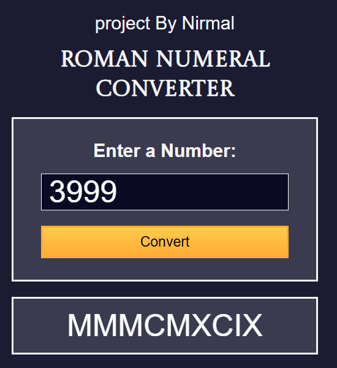
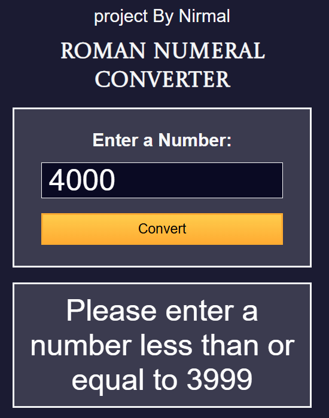
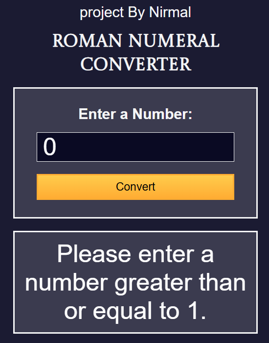

# Decimal to Roman Number Converter

## Overview

This project is a utility to convert decimal numbers into Roman numerals. It provides a simple and user-friendly interface for inputting decimal values and retrieving their Roman numeral representations.

## Features

- Converts any decimal number to its Roman numeral equivalent.
- Interactive and responsive design for a seamless user experience.
- Validates user input and handles errors gracefully.
- Supports real-time conversions for quick results.

## Technologies Used

- **HTML**: For the structure of the web interface.
- **CSS**: For styling the application.
- **JavaScript**: For handling conversions and interactivity.

## Usage

1. Clone the repository or download the source code.
2. Open the `index.html` file in a web browser.
3. Enter a decimal number in the input field.
4. Click the "Convert" button to see the Roman numeral equivalent.
5. If the input is invalid, the application will display an appropriate error message.

## Example

- Input: `1987`
- Output: `MCMLXXXVII`

## Demo


## Installation

1. Clone this repository:
   ```bash
   git clone https://github.com/Manusha-Nirmal-Perera/decimal-to-roman-number-converter.git

2.  open the index.html in a browser

## Roman number and Deceimal 
## Screenshot of the page

Below is an example of the Decimal to Binary Converter in action:
<div style="display: flex; justify-content: center; align-items: center; gap: 10px;">
    
    
    
</div>

